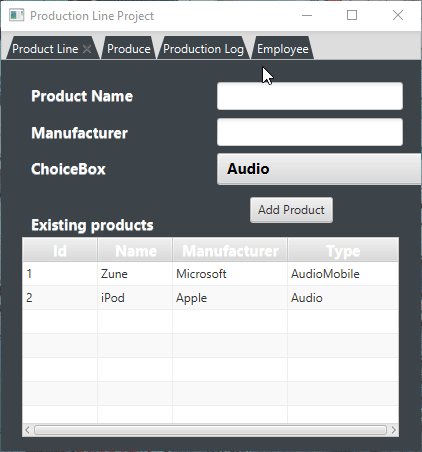
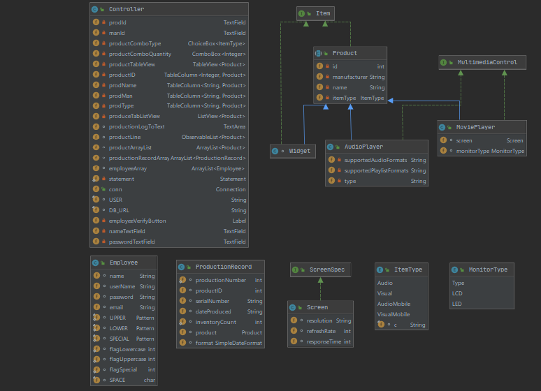

#Project Title
####<b>Scenario: </b>  
<i>You have been hired to create software for a media player production facility that will keep track of what products are produced.
Without the software, workers on the production floor are physically producing items and having to write down what is produced in a production log book.
Management would like the production tracking to be more automated so the workers don't need to spend as much time recording what was produced, the log will be more accurate, and it will be easier to generage production reports.</i>
  <b>What is the project?</b>  
This assignment represents the integrated use of Object Oriented programming incorporated with elements of front-end design, as well as the integration of an SQL database. The program was created by me with minor collaboration between the professor, as well as several other student assistance.    
The project began development in middle August, and spanned the entirety of the Fall 2020 semester at Florida Gulf Coast University. As of writing this program, my exposure to OOP languages is middle ground, as I understand concepts within the framework of OOP.   
<b>Purpose:</b> 
I created this program to show competency in my ability to program, and will continue to add functionality to the program after the class has ended. The program reflects my programming ability, and will serve as a benchmark as my skills improve.
  This program was created in COP3003 - Object Oriented Programming at Florida Gulf Coast University.

##Demonstration
<i>Program in action</i>  
    

##Documentation
Create a docs folder in your project. If using Java, generate JavaDoc in your IDE. If using C++, use Doxygen. Change repository settings (using Settings at top of page) to use GitHub Pages with your docs folder. Add a link to the javadoc/doxygen index.html file with this markdown: [Text to appear](URL)
The URL will be YourGitHubUserName.github.io/YourRepositoryName/foldername/filename
Do not include the docs folder name in your URL.
Sample: [JavaDoc](gradebuild/javadoc/index.html) * do this repository side

JavaDoc

##Diagrams
Class Diagram
The markdown is 

##Getting Started
To run the program, download the executable JAR file within the repository.

##Built With
<li>IntelliJ IDE</li> 
<li>Scene Builder</li>
<li>H2(SQL)</li>
<a href="https://sites.google.com/site/profvanselow/portfolio?authuser=0">Professor Vanselow's wesbite
</a>
#Contributing
The code on this repository is open source. Feel free to contribute!

##Author
Brandon Siegfried

##License
[License](src/resources/License.txt)

Go to your repository.
Click on "Create new file" Button.
Type the file name as License.txt or License.md in the input box next to your repository name, a drop down button appears towards right side.
Choose the type of license of your choice.
Click "Commit new file" button at the bottom (Green button) Credit https://stackoverflow.com/questions/31639059/how-to-add-license-to-an-existing-github-project
To choose a license, see https://choosealicense.com/

##Acknowledgments
Scott Vanselow  
Vladimir Hardy  
Brandon Santiago  
Logan Bahr  

Thank you.

##History
Submission finalized on 12/4/2020

##Key Programming Concepts Utilized
Object Oriented Programming, HTML, CSS, and SQL query language.
